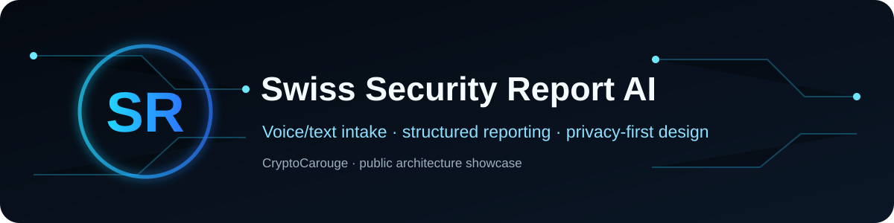
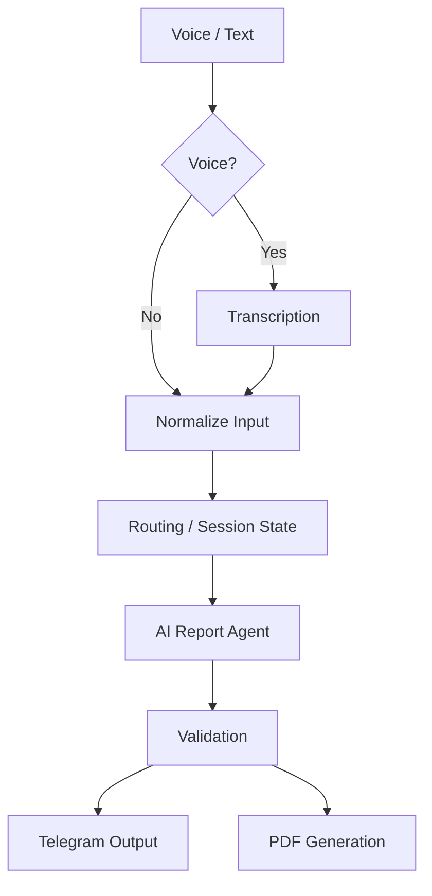

# Swiss Security Report AI Agent

A privacy-first AI automation project for turning voice or text input into structured professional incident reports in French.

This repository is a clean public portfolio edition. The production workflow and all organisation-specific procedures remain private.

> **Engineering case study:** [architecture decisions, failure modes and privacy boundary](docs/case-study.md)

## What it demonstrates

- Telegram voice or text input
- Audio transcription and input normalization
- AI-assisted structured report drafting
- Session continuity and callback routing
- PDF generation through Gotenberg
- Separation between deterministic workflow logic and LLM tasks
- Anti-hallucination constraints: missing facts should remain missing

## Architecture

## Design principles

1. **Facts first** — supplied information is the source of truth.
2. **Deterministic routing first** — conditions, callbacks and state are workflow logic where possible.
3. **AI only where useful** — transcription, interpretation and report drafting.
4. **Privacy by design** — real resident/client data is never part of this public repository.
5. **Operational output** — the goal is a usable report, not a generic chatbot response.

## Security boundary

Not published: API keys/tokens, chat IDs, private webhooks, employer-specific instructions, personal/resident data, production prompts or production workflow JSON.

## Disclaimer

Independent personal automation project. It is not an official product of, nor affiliated with, any security company or public authority.
